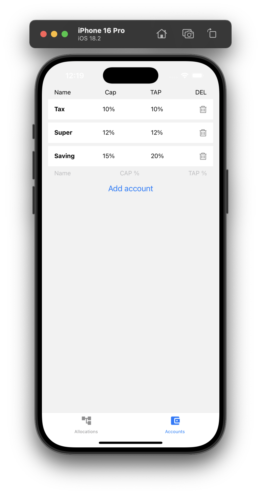
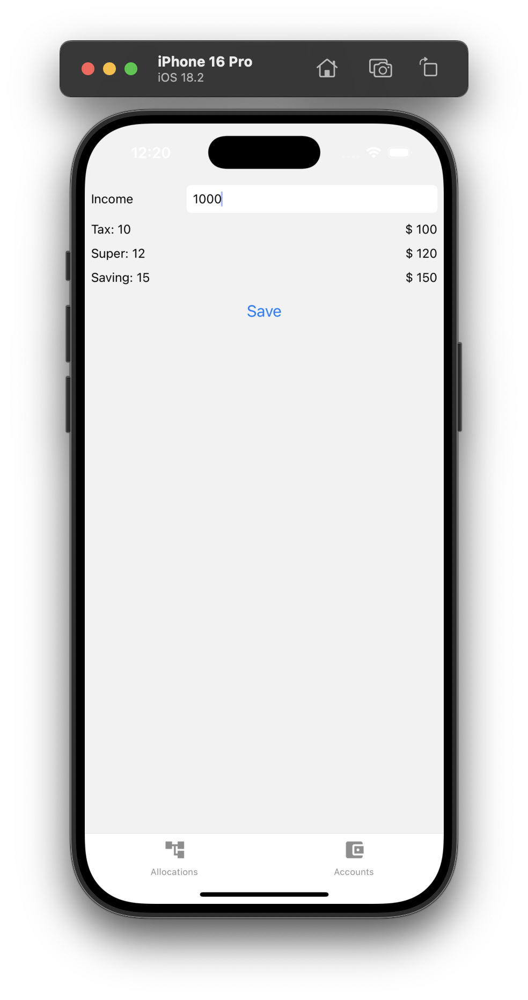
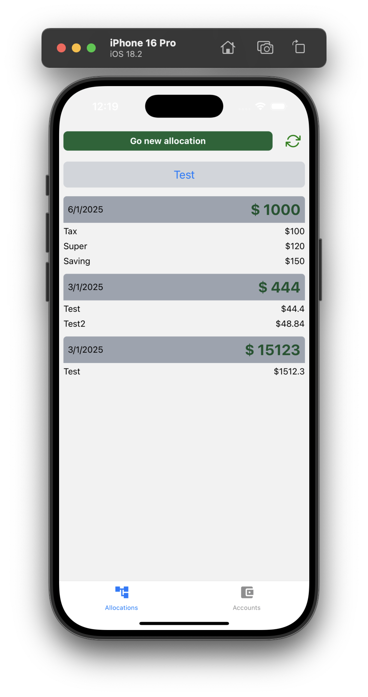
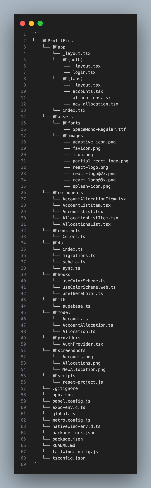

# Profit First App

This portfolio is created for learning and educational purpose with [notJust․dev](https://www.youtube.com/@notjustdev)

# <a name="table">📖 Table of Contents</a>

1. [🎯 Purpose](#purpose)
1. [📸 Screenshots](#screenshots)
1. [📚 What did I learn with this project?](#learn)
1. [💻 Used Programs](#programs)
1. [📁 Folder Structure](#folder)
1. [※ Reference](#reference)

<br>

## <a name="purpose">🎯 Purpose</a>

[Back](#table)<br>

### Portfolio: Learning Backend Logics with WatermelonDB

This portfolio aims to deepen my understanding of backend logics using WatermelonDB, with the ultimate goal of successfully deploying a React Native app on Android and iOS devices, as well as learning about local DB and remote DB synchronization.

<hr>
<br>

<details>
<summary>

## <a name="screenshots">📸 Screenshots</a>

[Back](#table)<br>

</summary>





</details>

<hr>
<br>

## <a name="learn">📚 What did I learn with this project?</a>

[Back](#table)<br>

<details>
<summary>

### Setting up WatermelonDB with Expo

</summary>

To get started with WatermelonDB in your Expo project, following these steps:

```sh
# Setup WatermelonDB: Install WatermelonDB by running
npm install @nozbe/watermelondb
npm install -D @babel/plugin-proposal-decorators
```

```sh
# Add ES6 decorators support to `.babelrc` file:
{
  "presets": ["module:metro-react-native-babel-preset"],
  "plugins": [["@babel/plugin-proposal-decorators", { "legacy": true }]]
}
```

```sh
# Prebuild for iOS and Android: Prebuilding WatermelonDB for both iOS and Android is necessary before using it in Expo app. This can be done by running
npx expo prebuild

# run iOS
npm run iOS

# run Android
npm run android
```

</details>
<details>
<summary>

### Local First Design

</summary>
To reduce traffic and enhance user experience, consider implementing a local first design:

- **Local Data Storage**: Store data locally on the device to minimize request to the remote database.
- **Data Syncing**: Set up data syncing with the remote database when necessary. This can be done using WatermelonDB's built-in syncing features.

</details>

<details>
<summary>

### Schema Design

</summary>
Schema design is crucial for successful synchronization and foreign key management in relation databases:

- **Entity-Attribute-Value (EAV) Model**: WatermelonDB uses an EAV model to store data, which allows for flexible schema design.

- **foreign Keys**: use foreign keys to establish relationships between entities. This enables efficient data retrieval and updating.
</details>

<details>
<summary>

### Best Practices

</summary>

For optimal performance and user experience:

- **Reduce Traffic**: Minimize requests to the remote database by storing data locally where possible.
- **Optimize Schema Design**: Ensure its schema design is optimized for data synchronization and querying.
- **Use foreign Keys**: Establish foreign keys to maintain relationship between entitles.
</details>

<hr>
<br>

## <a name="programs">💻 Used programs</a>

[Back](#table)<br>

### React Native (TypeScripts)

- **Overview**: Used for building native mobile apps, with TypeScript for added type safety and maintainability. This enables developers to create robust, scalable, and performant mobile applications.
- **Libraries/ Frameworks used**: `react-native`, `typescript`, `react-navigation`

### TailwindCSS (NativewindCSS)

- **Overview**: Utilized for styling the application, providing a utility-first approach to build fast, consistent, and customizable user interfaces. This enables developers to create visually appealing and responsive UI components.
- **Features**: Customizable CSS classes, Pre-defined components, Responsive design

### Expo

- **Overview**: Employed as a framework for managing the application's state and lifecycle, allowing for efficient and easy-to-use development of cross-platform mobile apps. This enables developers to focus on building the app's logic without worrying about the underlying complexities.
- **Libraries/ Frameworks used**: `expo`, `expo-sdk`

### WatermelonDB

- **Overview**: Used as an ORM (Object-Relational Mapping) library to interact with databases, simplifying the process of data storage and retrieval. This enables developers to focus on building business logic without worrying about database complexities.
- **Features**: Automatic schema management, SQL support, Type-safe queries

### Supabase

- **Overview**: Used as a PostgreSQL database service that provides a simple, GraphQL-based API and a beautiful web interface for managing your schema and data. This enables developers to create scalable, performant, and secure databases.
- **Features**: GraphQL-based API, Web interface, Automatic backups, Role-based access control

<hr>
<br>

<details>
<summary>

## <a name="folder">📁 Folder Structure</a>

[Back](#table)<br>

</summary>



</details>

<hr>
<br>

## <a name="reference">※ Reference</a>

[Back](#table)<br>

<details>
<summary>

### notJust.dev <image style="margin-left:10" width="40" src="https://cdn.prod.website-files.com/65cd13813bd3677534fa7c0b/674914272eb8906ba728d783_Logo_white.svg"/>

</summary>

- [Youtube](https://www.youtube.com/@notjustdev)
- [HomePage](https://www.notjust.dev/)

</details>

<details>
<summary>

### React Native <image style="margin-left:10" width="20" src="https://reactnative.dev/img/header_logo.svg"/>

</summary>

- [HomePage](https://reactnative.dev)

</details>

<details>
<summary>

### Expo <image style="background:white; padding:4;" width="50" src="./screenshots/logo-wordmark.svg"/>

</summary>

- [HomePage](https://expo.dev/)

</details>
<details>
<summary>

### WatermelonDB <image style="background:white; padding:4;" width="20" src="https://watermelondb.dev/img/logo.svg"/>

</summary>

- [HomePage](https://watermelondb.dev)

</details>
<details>
<summary>

### Supabase <image style="background:black; padding:4;" width="100" src="https://supabase.com/_next/image?url=%2F_next%2Fstatic%2Fmedia%2Fsupabase-logo-wordmark--dark.b36ebb5f.png&w=256&q=75&dpl=dpl_XN51ria8t2JcMGgJCQpsS6Rk3uRa"/>

</summary>

- [HomePage](https://supabase.com)

</details>
